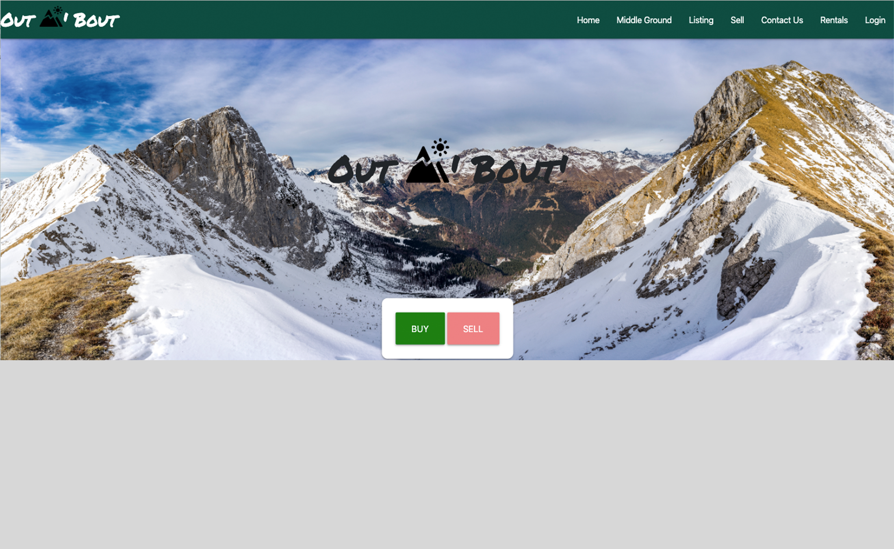

# Out N' Bout

Welcome to 
 <a href="https://out-n-about-project.herokuapp.com/">Out N' Bout. </a> A site built to buy, sell and rent outdoor equiptment.

<h2>How it Works</h2>

Out N' Bout' uses a MySQL database to store items for sale or rent. Centered around outdoor gear which can often be expensive A local community is able to buy, sell and rent out gear that may otherwise be finacially unobtainable. This project also incorporates a previous project, Middle Ground, offering a convenient place for buyers and sellers to meet inbetween their two addresses. 

&nbsp;

<h3>This project was built with:</h3>
<ul>
    <li>HTML</li>
    <li>JavaScript</li>
    <li>CSS</li>
    <li>jQuery</li>
    <li>Bootstrap</li>
    <li>Handlebars.js</li>
    <li>express</li>
    <li>MySQL</li>
    <li>Sequelize</li>
    <li>Nodejs</li>
</ul>
<h3>Group Members</h3>
<ul>
    <li>Alex Ogilvie</li>
    <li>Ben Linton</li>
    <li>Chason Law</li>
    <li>Lucas Difini</li>
</ul>
